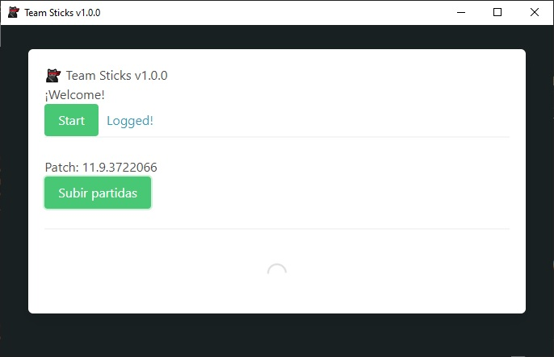

# Teamsticks 🐱‍👤

**_The app is focused on retrieve useful information for the Tier 3 competitive esports League of Legends scene._**



# Teamsticks Client 🐱‍🐉

_This desktop app is used to retrieve data from League of Legends client, and send it to mongo atlas db._

A few things you should know:

* (2022-01-20) Client is working again, i'm working on improving the viewer and the back-end. Once that's done the project will be officially finished. 
* (2021-04) Currently League of Legends is going through big changes on it's client, therefore this app is currently not working since matchlist endpoint is deprecated at the moment.
* Many people have asked me why i don't just use the Riot's ingame-api instead of lcu-api. Tier 3 plays on live environment, and it does inside custom games, every scrim and even National Circuits are played this way. Custom game data is simply not stored anywhere else, so the only way to retrieve this data is to get it from the lcu-api. 
* Once/if matchlist endpoint is working i will update the app.

## Starting 🚀

_This app retrieves two different objects from the league Client: A Matchlist(array of matches) and a timeline for every match_
For a fully working app you need four things up:

* This client
* Teamsticks-Backend mounted on a server like heroku.
* Teamsticks-Viewer to view the data.
* A MongoDB server running.

Look **Deployment** to know how to start the project.


### Pre-requirements 📋

_You need the MongoDB server running and League of Legends client open for this app to work_

App doesn't check if League Client is open, although this can be implemented i haven't done that yet.

### Deployment 🔧

_Download the project and install all dependencies_


```
npm install
```

_Modify .env_sample and add your conection string_
_Run electron forge via console to package the app_

```
npm run make
```

_Check out folder for your working app_


## Developed in 🛠️


* [Nodejs](https://nodejs.org/)
* [Electronjs](https://www.electronjs.org/)
* [Bulma](https://bulma.io/)


## Author ✒️


* **Luca de Acha** - [Github](https://github.com/T-NAVe) - [LinkedIn](https://www.linkedin.com/in/luca-de-acha/)


## License 📄

This project is under MIT-license check [MIT-LICENSE.txt](MIT-LICENSE.txt) for details.

## Thanks to 🎁

* Big shout out to Riot Games Third Party Developer Community [Discord](https://discord.com/invite/riotgamesdevrel)📢
